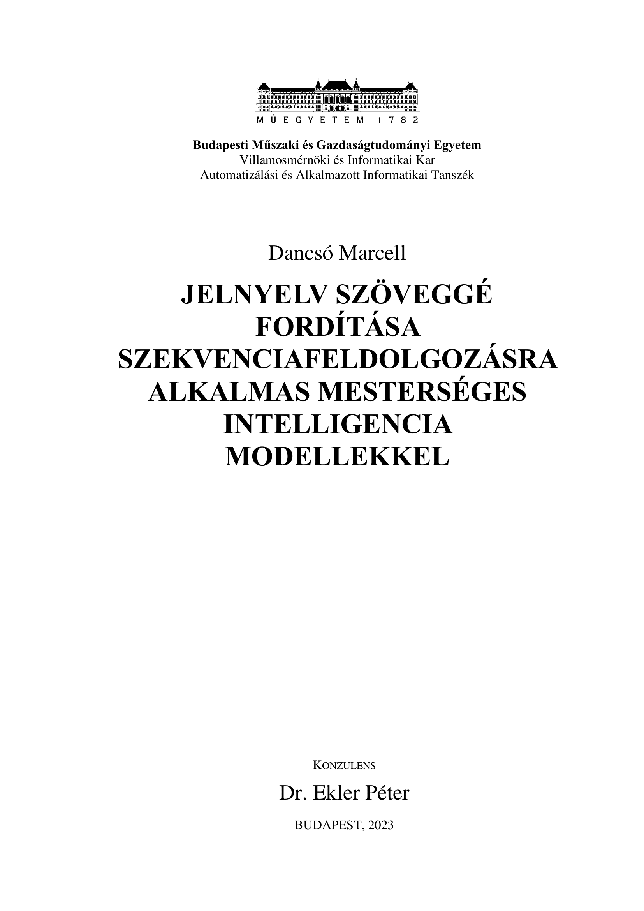

# ASL Sign language translation

This project investigates whether pose approximation is an appropriate way to translate sign language. For details on the project look at the `documentation`, or in the `python notebooks`. For hands on demo experience check out the `demo` folder.

|  | [*Sign language translation using pose approximation methods*](https://github.com/dancsomarci/sign-language/blob/main/documentation/Szakdolgozat.pdf)   Marcell Dancsó     :point_left: Journal paper, documenting the research.   :fire: Huge thanks to Dr. Ekler Péter my University Mentor|
| ------------------------------------------------------------ | :----------------------------------------------------------- |

## Folder structure:

| Folder       | Content |
|------------|-----|
| static-asl-fingerspelling       | Fingerspelling recognition from static images.  |
| asl-fingerspelling      | Seq2seq fingerspelling recognition.  |
| asl-signs        | Sign classification on 250 categories from sequential input.  |
| signing-detection | Simple signing detection model. (Binary classification.) |

## Example videos from the developed application:

https://github.com/dancsomarci/sign-language/assets/81509197/20be4f4e-5162-4ae8-85ba-a96ad456525e
